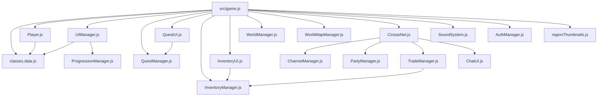

# Mapa de Dependências e Fluxo de Dados — Terra das Cinzas

**Data**: 2026-10-06  
**Análise**: Grafo de dependências estáticas de `src/`

---

## 1. Grafo Central de Módulos

---

## 2. Dependências Externas (Runtime & Build)

* `@supabase/supabase-js`: Utilizado exclusivamente por `src/systems/auth/AuthManager.js` para conexão com backend BaaS (autenticação e persistência).
* `esbuild`: Bundler de alta performance utilizado em `tools/build-pages.mjs` para empacotar o cliente em um único bundle ESM (`dist/game.bundle.js`).
* `wrangler`: CLI de desenvolvimento e deploy do Cloudflare Workers e Durable Objects em `multiplayer/`.

---

## 3. Estado das Dependências Circulares e Globais

* **Dependências Circulares**: Nenhuma dependência circular detectada entre os módulos ES6 em `src/`.
* **Comunicação por Globais (`window`)**:
  - Para manter compatibilidade com componentes legados e atalhos de depuração no console, os seguintes objetos são registrados no escopo global:
    - `window.GameClasses` (de `classes.data.js`)
    - `window.GameItems` (de `InventoryManager.js`)
    - `window.WorldMap` (de `WorldMapManager.js`)
    - `window.TalentTree` (de `TalentManager.js`)
    - `window.QuestUI` (de `QuestUI.js`)
    - `window.GameAuth` (de `AuthManager.js`)
    - `window._tdcRegions`, `window._tdcPlayer` (de `game.js`)
* **Fluxo de Eventos Customizados**:
  - `window.dispatchEvent(new CustomEvent('quests-updated'))`: Desacopla o rastreador de missões e a UI sem dependência direta cíclica.
